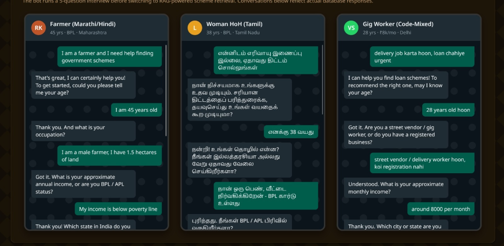

# AI-Based Multilingual Chatbot for Welfare Scheme Awareness

## Project Overview

This project is an AI-powered conversational chatbot designed to bridge the information gap for marginalized communities in India by providing multilingual access to government welfare schemes via WhatsApp. 

It features a beautiful React-based Glassmorphism dashboard for pilot presentation and a robust FastAPI backend powered by LangChain, FAISS vector embeddings, and Gemini's state-of-the-art Flash models.

## Demo & Example Flows

Here are some example conversation flows showing how the bot adapts to different user personas (e.g., Farmer, Woman Head of Household, Gig Worker) in various languages:



## Key Features

- **Multilingual Support**: Users can type in any language (Hindi, Bengali, Marathi, etc.), and the AI will automatically comprehend, retrieve data, and reply in the same language.
- **WhatsApp Integration**: Operates natively on WhatsApp via the Twilio Sandbox.
- **RAG Architecture**: Uses FAISS Vector Store and Google Generative AI embeddings (`models/gemini-embedding-2`) to accurately retrieve facts from `schemes_data.json` and prevent AI hallucinations.
- **Fail-safe Translation**: Includes a translation wrapper that natively falls back to Gemini's built-in multilingual capabilities if the Bhashini API goes offline.
- **Glassmorphism Dashboard**: A stunning, modern React frontend to showcase analytics and presentation details during hackathons/demos.

## Submission Flow / Usage Guide

For the purpose of evaluation and project submission, follow this structured flow to demonstrate the chatbot's capabilities:

1. **Persona Selection**: Ask the evaluator to adopt a specific persona (e.g., 45-year-old Farmer from Maharashtra, 38-year-old Woman BPL from Tamil Nadu, or a 28-year-old Gig Worker from Delhi).
2. **Initial Query**: Initiate the conversation on WhatsApp by stating the persona's problem in their native language or code-mixed language (e.g., "delivery job karta hoon, loan chahiye urgent").
3. **Automated Interview**: The chatbot will dynamically ask 4-5 contextual questions (age, occupation, income/status, state) to gather necessary eligibility criteria.
4. **RAG-Powered Retrieval**: Once the profile is built, the bot queries the FAISS vector database to retrieve the most relevant government schemes.
5. **Scheme Recommendation**: The bot responds with tailored scheme recommendations, explaining the benefits and application process in the user's chosen language.
6. **Dashboard Presentation**: Concurrently, showcase the React frontend dashboard to the evaluators to display real-time analytics, user insights, and the technical architecture backing the chatbot.

## Project Structure

```text
├── backend/                  # FastAPI Backend Server
│   ├── main.py               # Main API & Twilio Webhook logic
│   ├── rag_engine.py         # FAISS Vector DB & Retrieval Logic
│   ├── translation.py        # Bhashini Translation Module
│   ├── schemes_data.json     # Knowledge base of government schemes
│   └── requirements.txt      # Python dependencies
└── frontend/                 # React Dashboard
    ├── index.html            # Main HTML wrapper
    ├── main.js               # React Components & Logic
    └── style.css             # Glassmorphism UI styling
```

## Setup Instructions

### 1. Backend Setup

1. Open a terminal and navigate to the `backend` directory:
   ```bash
   cd backend
   ```
2. Create and activate a Python virtual environment:
   ```bash
   python -m venv venv
   # On Windows:
   .\venv\Scripts\activate
   # On Mac/Linux:
   source venv/bin/activate
   ```
3. Install the required dependencies:
   ```bash
   pip install -r requirements.txt
   ```
4. Create a `.env` file in the `backend` folder and add your API keys:
   ```env
   # LLM Engine
   GEMINI_API_KEY=your_gemini_api_key_here
   
   # WhatsApp / Twilio Sandbox
   TWILIO_ACCOUNT_SID=your_twilio_sid
   TWILIO_AUTH_TOKEN=your_twilio_auth_token
   
   # Translation API (Optional, fallback to Gemini if empty)
   BHASHINI_API_KEY=
   ```
5. Start the FastAPI server:
   ```bash
   uvicorn main:app --reload
   ```
   The backend will now be running on `http://localhost:8000`.

### 2. Ngrok Setup (Exposing Localhost to the Internet)

Twilio needs a public URL to send incoming WhatsApp messages to your local backend.

1. Install [Ngrok](https://ngrok.com/).
2. Open a new terminal and run:
   ```bash
   ngrok http 8000
   ```
3. Ngrok will generate a Forwarding URL (e.g., `https://a1b2-34-56-78.ngrok-free.app`). **Copy this URL.**

### 3. Twilio WhatsApp Sandbox Setup

1. Log in to your [Twilio Console](https://console.twilio.com/).
2. Navigate to **Messaging > Try it out > Send a WhatsApp message**.
3. Follow the instructions to join the Twilio Sandbox from your personal WhatsApp number (e.g., sending "join bold-word" to the Twilio number).
4. Go to **Sandbox Settings**.
5. In the "When a message comes in" field, paste your Ngrok URL followed by `/webhook`:
   ```text
   https://a1b2-34-56-78.ngrok-free.app/webhook
   ```
6. Ensure the method is set to **HTTP POST** and save the settings.
7. Send a message to the Twilio sandbox number from your WhatsApp to test!

### 4. Frontend Setup

1. Open a new terminal and navigate to the `frontend` directory:
   ```bash
   cd frontend
   ```
2. Install the necessary Node packages (if using Vite/React):
   ```bash
   npm install
   ```
3. Run the development server:
   ```bash
   npm run dev
   ```
4. Open the provided localhost link (usually `http://localhost:5173`) in your browser to view the presentation dashboard.
